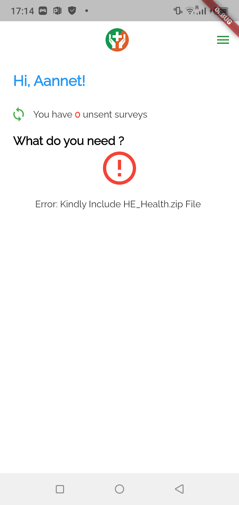

# JOSHUA NJOVU

**TEL:** \+63 961 033 1326  
**Contacts:** [njovujsh@gmail.com](mailto:njovujsh@gmail.com), [LinkedIn](https://www.linkedin.com/in/njovu-joshua/), [Stackoverflow](https://stackoverflow.com/users/3384760/joash%20) (1M+ views)

## PROFILE

I'm a dedicated mobile software engineer and designer with over 7 years of specialized experience in native and cross-platform mobile application development. Expert in Kotlin, Java, Dart (Flutter), and Objective-C, with deep proficiency in modern mobile frameworks including Jetpack Compose, SwiftUI, and Flutter. My work spans Android (from J2ME to latest Android SDK) and iOS platforms, leveraging cloud technologies like Firebase Cloud, AWS (ElastiCache), and Google Cloud (Cloud Firestore, Dataflow) for scalable mobile backend solutions. I have substantial experience with mobile-specific architectures (MVVM, MVI, Clean Architecture) and Agile Development Methodologies. My passion lies in crafting efficient, user-centric mobile applications that deliver exceptional user experiences and solve real-world problems.

## KEY SKILLS AND COMPETENCES

### Mobile Development

Versatile Full-Stack Mobile Developer with over 7 years of experience in designing, developing, and maintaining mobile applications for Android (from the days of J2ME) and iOS platforms. Expert in Kotlin, Java SE 7 to Java SE 20, Dart, and Swift, with sufficient experience in Objective-C, which comes in handy when optimizing iOS platforms on cross-platform frameworks like Flutter and React Native. Proficient in modern UI frameworks like Jetpack Compose, SwiftUI, and Flutter widgets. Proven track record of integrating complex REST APIs, GraphQL, Firebase services, and managing data with Room, CoreData, Realm, and Android SDK. Experienced with mobile CI/CD pipelines, App Store and Play Store deployment, and mobile app performance optimization.

#### Mobile Projects Implemented:

---

### 1. HE Health App
**Associated with:** Healthy Entrepreneurs  
**Link:** [LinkedIn Project Details](https://www.linkedin.com/in/njovu-joshua/details/projects/?profileUrn=urn%3Ali%3Afsd_profile%3AACoAAA35CnUBajKhsMOSIOmAlfYfNPLe_yD9TTQ)

**Description:**
* A pioneering platform in healthcare education and management
* Built upon Moodle framework, H5P, and Survey JS
* Focuses on combating health misinformation, providing quality healthcare education, and streamlining healthcare processes

**Screenshots:**

  
  
  

  
  
  

  
  
  

---

### 2. Spotout
**Associated with:** Definite Creations  
**Link:** [Download on APKPure](https://apkpure.com/spotout/com.spotouto)

**Description:**
* Links opportunities with buyers, sellers, and other business types
* Organizes information in categories for easy access
* Provides seamless marketplace experience for various business operations

**Screenshots:**

  
  
  
  

  
  
  

---

### 3. AmbulanceChap
**Associated with:**   
**Link:** [Download on APKPure](https://apkpure.com/ambulancechap/chap.taxichap)

**Description:**
* Helps patients contact hospital ambulances in emergencies
* Includes built-in maps for navigation and real-time tracking
* Streamlines emergency response coordination

**Screenshots:**

  
  
  

---

### 4. Inspec Pack
**Associated with:**  
**Link:** [Download on APKPure](https://apkpure.com/inspec-pack/com.inspec)

**Description:**
* Reporting application for SYAMA MINES
* Generates comprehensive reports on the state of tools and motor vehicles
* Facilitates equipment inspection and maintenance tracking

**Screenshots:**

  
  
  
  

  
  
  

---

#### Mobile Application Stacks and Skills:

- **Languages:** Kotlin, Dart (Flutter), Swift, Objective-C, Java 8+

- **Frameworks & Tools:** Jetpack Compose, SwiftUI, Flutter, Android SDK, iOS SDK, CoreData, Room, Hilt/Dagger, Koin

- **State Management:** Bloc, Provider, Riverpod (Flutter), ViewModel, LiveData, Flow (Android)

- **Databases:** SQLite (via Android SDK and CoreData), Room, Realm, Objectbox, Firebase Realtime Database

- **APIs & Backend:** REST APIs, GraphQL, Firebase (Auth, Firestore, Cloud Functions, FCM), Retrofit, Alamofire

- **Development Tools:** Android Studio, Xcode, Git, Jenkins, Fastlane, Firebase App Distribution

- **Testing:** JUnit, Espresso, XCTest, Flutter Test, Mockito

- **Other Skills:** Agile methodologies, UX/UI design principles, Material Design, Human Interface Guidelines, App Store optimization

### Architectures:

- Mobile Architecture Patterns (MVVM, MVI, MVP, Clean Architecture)

- Design Patterns (Singleton, Factory, Repository, Observer, Decorator)

- Agile Development Methodology (Scrum, DevOps, Kanban)

- Microservices and RESTful backend integration

### Programming Languages:

- Mobile: Kotlin, Dart (Flutter), Swift, Java, Objective-C

- Backend: Python, Go, PHP, Java, Scala

- Web Frontend: TypeScript, ES6, Vue JS, Svelte

### Cloud Technologies:

- Firebase (Auth, Firestore, Cloud Functions, FCM, Analytics, Crashlytics)

- AWS, Google Cloud (GCP)

- GitLab, Circle CI, Bitbucket, Jenkins, Fastlane

- Kibana, Celery, Jira, Linux

### Frameworks and Technologies:

- Mobile: Flutter, Jetpack Compose, SwiftUI, React Native, Retrofit, Alamofire

- Backend: Spring Boot, Quarkus, Django, Flask, FastAPI, CodeIgniter, Laravel

- DevOps: Docker, Kubernetes, Fastlane, uWSGI, Nginx, Apigee, Terraform

### Databases:

- Mobile: SQLite, Room, Realm, CoreData, Objectbox, Firebase Firestore, Hive

- NoSQL and Relational: Cassandra, RethinkDB, PostgreSQL, MySQL, BigQuery

## PERSONAL SKILLS

- Self-taught in most programming concepts

- People management skills

- Active contributor to learning communities (e.g., [CiviCRM community](https://civicrm.stackexchange.com/users/6106/joash), [StackOverflow](https://stackoverflow.com/users/3384760/joash?tab=reputation))
